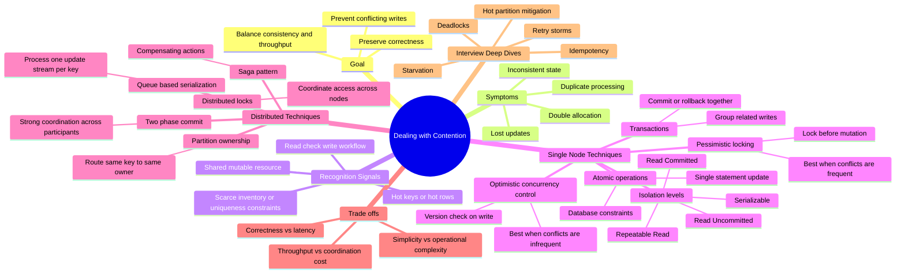

# Dealing with Contention

## At a Glance

- **What it is:** many requests try to update the same resource at the same time.
- **What breaks:** lost updates, over-allocation, duplicate work, inconsistent state.
- **Primary goal:** preserve correctness while keeping throughput acceptable.
- **Main design choice:** optimistic control, pessimistic control, or serialized processing.
- **Interview focus:** identify where conflicts happen, then justify the lightest mechanism that preserves correctness.

## Recognition Signals

- A resource is scarce or must not be over-allocated.
- Multiple users may write the same row, key, or object concurrently.
- The system performs read-check-write logic.
- Correctness matters more than raw write throughput for that path.
- Retries alone are not sufficient because duplicate success is harmful.

## Mermaid Mindmap

## Core Techniques

### 1. Atomic Operations

- Best first choice when a single database statement can enforce correctness.
- Avoids a separate read-check-write race.
- Common tools:
  - Atomic increment or decrement
  - Conditional update
  - Unique constraint
  - Compare-and-set
- Best when one resource can be protected inside one storage system.

### 2. Transactions

- Use when several writes must succeed or fail together.
- Provides atomicity and consistency across related changes.
- Often sufficient on a single database node or within one database cluster.
- Cost: more locking, more contention, more latency under load.

### 3. Isolation Levels

| Level | Dirty Read | Non-repeatable Read | Phantom Read | Summary |
|---|---|---|---|---|
| Read Uncommitted | Possible | Possible | Possible | Rarely used for critical writes |
| Read Committed | Prevented | Possible | Possible | Common default, moderate safety |
| Repeatable Read | Prevented | Prevented | Possible | Stronger read stability |
| Serializable | Prevented | Prevented | Prevented | Strongest correctness, highest cost |

### 3.1 Oracle vs PostgreSQL

| Database | Supported Levels | Default | Under the Hood |
|---|---|---|---|
| Oracle | Read Committed, Serializable, Read Only | Read Committed | MVCC with undo segments for consistent reads; serializable uses snapshot-based conflict detection |
| PostgreSQL | Read Uncommitted, Read Committed, Repeatable Read, Serializable | Read Committed | MVCC with tuple versions; serializable uses Serializable Snapshot Isolation (SSI) plus predicate locking |

#### Oracle

- **MVCC model:** readers use a consistent snapshot reconstructed from undo data, so normal reads do not block writes and writes do not block reads.
- **Read Committed:**
  - Default level.
  - Each statement gets its own snapshot of committed data at statement start.
  - Prevents dirty reads.
  - Still allows non-repeatable reads and phantoms across statements in the same transaction.
- **Serializable:**
  - Oracle provides transaction-level read consistency using a snapshot taken at transaction start.
  - It is implemented more like snapshot isolation with conflict detection than with heavy read locks.
  - If Oracle cannot serialize the outcome, it raises `ORA-08177: can't serialize access for this transaction`; the application should retry.
  - Important interview point: Oracle generally does **not** rely on range locks / next-key locks to prevent phantoms here.
- **Read Only:**
  - Same transaction-level consistent snapshot as serializable, but disallows writes.
- **Locking behavior:**
  - DML acquires row-level locks on modified rows.
  - `SELECT ... FOR UPDATE` acquires row locks for explicit pessimistic locking.
  - Normal `SELECT` does not take blocking read locks.

#### PostgreSQL

- **MVCC model:** each row version carries transaction visibility metadata, and readers see a snapshot without blocking writers.
- **Read Uncommitted:**
  - Accepted syntactically, but effectively treated as **Read Committed**.
  - PostgreSQL does not allow dirty reads.
- **Read Committed:**
  - Default level.
  - Each statement sees a fresh snapshot of rows committed before that statement begins.
  - Prevents dirty reads.
  - Still allows non-repeatable reads and phantoms across statements.
- **Repeatable Read:**
  - Uses one transaction-level snapshot for the whole transaction.
  - In PostgreSQL, this is stronger than the SQL minimum and is effectively **snapshot isolation**.
  - Prevents dirty reads and non-repeatable reads; many phantom-like effects are also avoided because the snapshot is fixed.
  - Write-write or read-write conflicts can still surface as serialization-style retry errors in some cases.
- **Serializable:**
  - Built on **Serializable Snapshot Isolation (SSI)**, not on simple blocking locks alone.
  - PostgreSQL tracks dangerous dependency patterns between concurrent transactions.
  - It uses **predicate locks** (`SIReadLock`) to remember what ranges or predicates were read.
  - These are not classic next-key locks like InnoDB; they are logical read dependencies used to detect serialization anomalies.
  - On detecting an unsafe pattern, PostgreSQL aborts one transaction with `could not serialize access due to read/write dependencies`; the app must retry.
- **Locking behavior:**
  - Row locks are taken for writes and explicit locking reads like `SELECT ... FOR UPDATE`.
  - Predicate locking matters mainly at the `Serializable` level.
  - Under memory pressure, predicate locks may be promoted from tuple/index-range granularity to page or relation granularity.

#### Quick Interview Takeaways

- **Oracle Serializable:** think "MVCC snapshot + conflict error," not "range locking."
- **PostgreSQL Repeatable Read:** think "snapshot isolation."
- **PostgreSQL Serializable:** think "SSI + predicate locks + retry on serialization failure."
- **Both databases:** use MVCC so ordinary reads usually do not block ordinary writes.

### 3.2 Isolation Levels vs OCC vs Pessimistic Locking

- **Isolation level** defines what anomalies the database allows across statements in a transaction.
- **OCC vs pessimistic locking** defines how your application or transaction coordinates conflicting updates.
- They are **not the same knob**, but they interact strongly in real systems.
- A useful mental model:
  - **Isolation level** = baseline guarantees from the database
  - **OCC / pessimistic locking** = additional coordination you add for a specific invariant

#### How They Fit Together

| Choice | What it does | What it does not automatically do |
|---|---|---|
| Lower isolation (`Read Committed`) | Cheap baseline, good throughput | Does not protect multi-step read-check-write logic by itself |
| Higher isolation (`Repeatable Read` / `Serializable`) | Prevents more anomalies at transaction scope | May still need retries or may reduce throughput |
| OCC | Detects conflicting writes late and retries | Does not magically prevent predicate/range anomalies unless the read set is fully protected |
| Pessimistic locking | Blocks conflicting writers early | Does not automatically protect rows that were never locked |

#### OCC with Isolation Levels

- OCC is often paired with **Read Committed**.
- Typical pattern:
  - Read current row version
  - Compute new value
  - Update with `WHERE id = ? AND version = ?`
  - If `0 rows updated`, a conflict happened; retry
- Why this combination is common:
  - Keeps the database at a cheaper isolation level
  - Avoids long blocking waits
  - Works well when contention is low or moderate
- What it protects well:
  - **Single-row invariants**
  - Lost-update prevention
  - Compare-and-set style writes
- What it does **not** protect well at low isolation:
  - Cross-row invariants
  - Predicate-based rules like "no overlapping reservation"
  - "Count rows, then insert" workflows
- For those cases, OCC usually needs one of:
  - A stronger isolation level such as `Serializable`
  - A uniqueness or exclusion constraint
  - A materialized lock row or owner record
  - Queue-based serialization by key

#### Pessimistic Locking with Isolation Levels

- Pessimistic locking is often paired with **Read Committed** plus explicit locking reads like `SELECT ... FOR UPDATE`.
- Why this combination is common:
  - You lock only the rows that matter
  - You avoid paying `Serializable` cost for the whole transaction
  - You get deterministic protection for known hot rows
- What it protects well:
  - Known rows that must be updated safely
  - Short critical sections under high contention
  - Workflows where retrying is expensive
- What it does **not** fully protect by itself:
  - Predicates or ranges that do not yet map to a locked row
  - Insert races when multiple transactions are competing to create a new qualifying row
- For predicate/range correctness, you may still need:
  - `Serializable`
  - Database-specific range/predicate protection
  - A dedicated lock record per logical resource

#### Effect on Isolation Level Choice

| If you choose... | You can often run at... | Because... | Main cost |
|---|---|---|---|
| OCC for single-row updates | `Read Committed` | Version checks catch conflicting writes | Retries under contention |
| Pessimistic locking on known rows | `Read Committed` | Explicit row locks protect the hot resource | Blocking, deadlocks |
| OCC for cross-row or predicate rules | `Serializable` or extra constraints | Low isolation is too weak for full correctness | More aborts or more complexity |
| Pessimistic locking for range predicates | `Serializable` or DB-specific gap/range protection | Row locks alone do not cover missing/future rows | Higher coordination cost |
| Database-level `Serializable` | Sometimes no extra app-level OCC/locks | DB detects or prevents anomalies directly | Lower throughput, retry/abort behavior |

#### Practical Design Guidance

##### When OCC lets you stay on a lower isolation level

- The invariant is attached to a **single existing row**.
- Conflicts are infrequent.
- Retries are cheap.
- You want high concurrency and low lock wait time.
- Example shape:
  - balance update
  - versioned profile edit
  - inventory decrement on one row with compare-and-set

##### When pessimistic locking lets you stay on a lower isolation level

- The resource already has a concrete row you can lock.
- Contention is high.
- The critical section is short.
- Retrying is costly or user-visible.
- Example shape:
  - lock account row, then post debit
  - lock job row, then claim work

##### When a higher isolation level is still needed

- The invariant spans **multiple rows**.
- The invariant is defined by a **query predicate**, not one row.
- New rows can appear and violate correctness.
- You cannot easily reduce the problem to a single lockable owner row.
- Example shape:
  - no overlapping booking windows
  - only one active leader per shard
  - sum across multiple rows must stay below a limit

#### Trade-Offs

| Dimension | OCC | Pessimistic Locking |
|---|---|---|
| Conflict handling | Detect late, retry | Prevent early, block |
| Best contention profile | Low conflict rate | High conflict rate |
| Latency profile | Usually low, but spiky on retries | Stable when uncontended, worse under lock waits |
| Throughput | High when conflicts are rare | Lower on hot rows due to serialization |
| Failure mode | Retry storms | Deadlocks, lock queues |
| User experience | Occasional retry/error | Waiting and tail latency |
| Operational complexity | Simpler in distributed systems | Harder across nodes/services |

#### Interview Framing

- Start by naming the **invariant**.
- Then say whether contention is on:
  - a known row
  - a set of rows
  - a query predicate
- Then justify the minimum mechanism:
  - **known row + low contention** -> `Read Committed` + OCC
  - **known row + high contention** -> `Read Committed` + `SELECT ... FOR UPDATE`
  - **predicate or cross-row invariant** -> constraint, owner row, queue serialization, or `Serializable`
- Final rule of thumb:
  - If you can reduce correctness to **one row**, lower isolation + explicit coordination is often enough.
  - If correctness depends on **a set defined by a query**, isolation level becomes much more important.

### 4. Pessimistic Locking

- Lock the resource before modifying it.
- Assumes conflicts are likely.
- Prevents concurrent writers from proceeding simultaneously.
- Good for:
  - Very high contention
  - Expensive conflicts
  - Small critical sections
- Risks:
  - Deadlocks
  - Lower throughput
  - Higher tail latency

### 5. Optimistic Concurrency Control

- Allow concurrent reads and writes, then reject conflicting commits.
- Usually implemented with a version number, timestamp, or compare-and-swap token.
- Assumes conflicts are relatively rare.
- Good for:
  - Low to moderate contention
  - High read volume
  - Short retry cost
- Risks:
  - More retries under hotspots
  - Retry storms if contention spikes

### 6. Queue-Based Serialization

- Route updates for the same key through a single ordered stream.
- Turns concurrent mutation into sequential processing.
- Good for:
  - Hot keys
  - Deterministic ordering requirements
  - Event-driven systems
- Risks:
  - Added end-to-end latency
  - Backlogs on hot partitions

## Distributed Coordination

### Partition Ownership

- Ensure one logical owner handles writes for a given key or shard.
- Reduces cross-node coordination for same-key updates.
- Often the simplest scalable answer if routing by key is possible.

### Distributed Locks

- Coordinate exclusive access across multiple services or nodes.
- Useful when the resource spans more than one process.
- Require careful handling of:
  - Lease expiry
  - Clock assumptions
  - Fencing tokens
  - Lock recovery after failure

### Two-Phase Commit (2PC)

- Coordinates a single commit decision across multiple participants.
- Stronger consistency than loosely coordinated approaches.
- Drawbacks:
  - Coordinator dependency
  - Blocking behavior
  - Operational complexity
  - Poor fit for very high scale systems

### Saga Pattern

- Breaks a multi-step workflow into local transactions with compensating actions.
- Favors availability and scalability over strict global atomicity.
- Good when eventual consistency is acceptable.
- Requires idempotency and carefully designed compensation.

## How to Choose

| Situation | Preferred Approach |
|---|---|
| Single-row invariant in one database | Atomic update or constraint |
| Several related writes in one database | Transaction |
| Conflicts are frequent | Pessimistic locking |
| Conflicts are rare | Optimistic concurrency control |
| Same key can be routed to one owner | Partition ownership |
| Need ordered processing per key | Queue-based serialization |
| Multi-service workflow with rollback path | Saga pattern |
| Need strict cross-node commit | 2PC |

## Trade-Off Summary

| Approach | Strength | Weakness |
|---|---|---|
| Atomic operation | Simple and fast | Limited scope |
| Transaction | Strong correctness | More locking and latency |
| Pessimistic locking | Prevents conflicts early | Deadlocks and reduced throughput |
| Optimistic concurrency | High parallelism | Retries under contention |
| Distributed lock | Cross-node coordination | Failure handling is tricky |
| Queue serialization | Deterministic ordering | Hot partitions can bottleneck |
| 2PC | Strong coordination | High complexity and blocking |
| Saga | Scalable and resilient | Eventual consistency, compensation complexity |

## Interview Checklist

- What is the shared resource?
- What invariant must always hold?
- Is contention local to one database or distributed across services?
- Are conflicts common or rare?
- Can I avoid the race with an atomic write instead of adding locks?
- What happens during retries, crashes, or partial failure?
- Do I need strict consistency or is eventual consistency acceptable?

## Common Follow-Ups

- How do you prevent deadlocks?
- How do you avoid retry storms on hot keys?
- How do you make retries idempotent?
- How do you recover if the coordinator or lock holder crashes?
- How do you reduce hotspots with sharding or partitioning?
