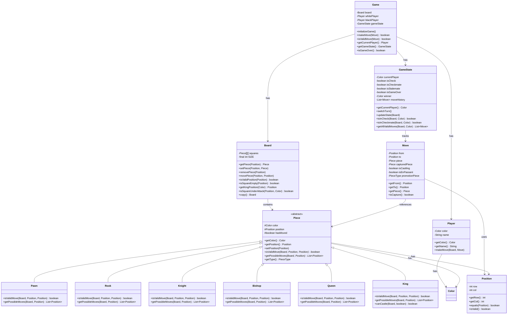

# Chess Game - Class Design and Model

## Core Entities

### 1. Position
Represents a position on the chess board (row and column).

**Attributes:**
- `row` (int): Row number (0-7)
- `col` (int): Column number (0-7)

**Methods:**
- `getRow()`: Returns the row
- `getCol()`: Returns the column
- `equals()`: Compares two positions
- `isValid()`: Checks if position is within board bounds

### 2. Piece (Abstract Class)
Base class for all chess pieces.

**Attributes:**
- `color` (Color enum: WHITE, BLACK): Color of the piece
- `position` (Position): Current position on the board
- `hasMoved` (boolean): Whether the piece has moved (important for castling and pawn double move)

**Methods:**
- `getColor()`: Returns the color of the piece
- `getPosition()`: Returns the current position
- `setPosition(Position)`: Sets the position
- `isValidMove(Board, Position, Position)`: Abstract method to validate if a move is valid
- `getPossibleMoves(Board, Position)`: Abstract method to get all possible moves from a position
- `getType()`: Returns the type of piece

### 3. Concrete Piece Classes
All extend the `Piece` abstract class:
- **Pawn**: Moves forward one square, captures diagonally, can move two squares on first move
- **Rook**: Moves horizontally and vertically any number of squares
- **Knight**: Moves in L-shape (2 squares in one direction, 1 square perpendicular)
- **Bishop**: Moves diagonally any number of squares
- **Queen**: Combines Rook and Bishop movement
- **King**: Moves one square in any direction, can castle

### 4. Board
Represents the 8x8 chess board.

**Attributes:**
- `squares` (Piece[8][8]): 2D array representing the board
- `SIZE` (final int = 8): Board size constant

**Methods:**
- `getPiece(Position)`: Returns piece at given position
- `setPiece(Position, Piece)`: Places a piece at given position
- `removePiece(Position)`: Removes piece from position
- `movePiece(Position, Position)`: Moves piece from source to destination
- `isValidPosition(Position)`: Checks if position is within bounds
- `isSquareEmpty(Position)`: Checks if square is empty
- `isSquareOccupied(Position)`: Checks if square has a piece
- `getKingPosition(Color)`: Finds the king of given color
- `isSquareUnderAttack(Position, Color)`: Checks if a square is under attack by opponent
- `copy()`: Creates a deep copy of the board (useful for move validation)

### 5. Move
Represents a chess move.

**Attributes:**
- `from` (Position): Source position
- `to` (Position): Destination position
- `piece` (Piece): Piece being moved
- `capturedPiece` (Piece): Piece being captured (if any)
- `isCastling` (boolean): Whether this is a castling move
- `isEnPassant` (boolean): Whether this is an en passant move
- `promotionPiece` (PieceType): Piece type for pawn promotion (if applicable)

**Methods:**
- `getFrom()`: Returns source position
- `getTo()`: Returns destination position
- `getPiece()`: Returns the piece being moved
- `getCapturedPiece()`: Returns captured piece
- `isCapture()`: Checks if this move captures a piece

### 6. Player
Represents a chess player.

**Attributes:**
- `color` (Color enum: WHITE, BLACK): Player's color
- `name` (String): Player's name (optional)

**Methods:**
- `getColor()`: Returns player's color
- `getName()`: Returns player's name
- `makeMove(Board, Move)`: Makes a move on the board

### 7. GameState
Tracks the current state of the game.

**Attributes:**
- `currentPlayer` (Color): Current player's turn
- `isCheck` (boolean): Whether current player is in check
- `isCheckmate` (boolean): Whether current player is in checkmate
- `isStalemate` (boolean): Whether game is in stalemate
- `isGameOver` (boolean): Whether game has ended
- `winner` (Color): Winner of the game (if game is over)
- `moveHistory` (`List<Move>`): History of all moves made

**Methods:**
- `getCurrentPlayer()`: Returns current player
- `switchTurn()`: Switches to the other player
- `updateState(Board)`: Updates game state based on current board position
- `isInCheck(Board, Color)`: Checks if a player is in check
- `isInCheckmate(Board, Color)`: Checks if a player is in checkmate
- `isStalemate(Board, Color)`: Checks if game is in stalemate
- `getAllValidMoves(Board, Color)`: Gets all valid moves for a player

### 8. Game
Main controller class that orchestrates the game.

**Attributes:**
- `board` (Board): The chess board
- `whitePlayer` (Player): White player
- `blackPlayer` (Player): Black player
- `gameState` (GameState): Current game state

**Methods:**
- `initializeGame()`: Sets up the initial board and game state
- `makeMove(Move)`: Attempts to make a move, validates and executes if valid
- `isValidMove(Move)`: Validates if a move is legal
- `getCurrentPlayer()`: Returns the current player
- `getGameState()`: Returns the current game state
- `isGameOver()`: Checks if the game has ended
- `getWinner()`: Returns the winner (if game is over)

## Class Diagram

## Relationships

### Inheritance
- All concrete piece classes (`Pawn`, `Rook`, `Knight`, `Bishop`, `Queen`, `King`) inherit from the abstract `Piece` class
- This allows polymorphic handling of pieces and follows the Open/Closed Principle

### Composition
- `Board` contains a 2D array of `Piece` objects
- `Game` contains `Board`, `Player` objects, and `GameState`
- `GameState` contains a list of `Move` objects (move history)
- `Move` contains `Position` and `Piece` references

### Association
- `Move` references `Position` objects (from and to)
- `Move` references `Piece` objects (piece being moved and captured piece)
- `Player` is associated with a `Color`
- `Piece` is associated with a `Color` and `Position`

### Dependencies
- `Piece` classes depend on `Board` for move validation
- `GameState` depends on `Board` for state calculations
- `Game` depends on all other classes to orchestrate the game

## Design Patterns Applied

1. **Strategy Pattern**: Each piece type implements its own movement strategy through the abstract `isValidMove()` and `getPossibleMoves()` methods
2. **Template Method Pattern**: The `Piece` abstract class defines the template for piece behavior, with concrete classes implementing specific logic
3. **Factory Pattern**: Can be used to create pieces during board initialization

## SOLID Principles

1. **Single Responsibility**: Each class has a single, well-defined responsibility
   - `Board`: Manages board state
   - `Piece`: Represents a chess piece
   - `Game`: Orchestrates game flow
   - `GameState`: Tracks game state

2. **Open/Closed**: The `Piece` abstract class is open for extension (new piece types) but closed for modification

3. **Liskov Substitution**: Any concrete piece can be substituted for the `Piece` abstract class

4. **Interface Segregation**: Classes only depend on methods they actually use

5. **Dependency Inversion**: High-level modules (Game) depend on abstractions (Piece), not concrete implementations

