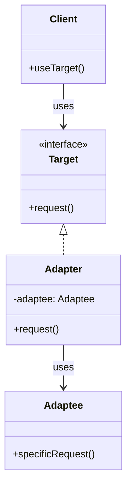

# Adapter Pattern

## Description

The Adapter Pattern is a structural design pattern that allows objects with incompatible interfaces to collaborate. It acts as a bridge between two incompatible interfaces by wrapping an object with an adapter class that translates calls from one interface to another. This pattern enables classes to work together that couldn't otherwise because of incompatible interfaces.

The Adapter Pattern solves the problem of making two incompatible interfaces work together. Instead of modifying existing code (which may not be possible or desirable), the adapter acts as a translator, converting the interface of one class into an interface that the client expects.

The pattern consists of four main components:
- **Target Interface**: The interface that the client expects to work with
- **Adaptee**: The existing class with an incompatible interface that needs to be adapted
- **Adapter**: The class that implements the Target interface and wraps the Adaptee, translating calls between the two interfaces
- **Client**: The class that uses the Target interface

There are two main types of Adapter Pattern implementations:
- **Object Adapter**: Uses composition to wrap the adaptee object
- **Class Adapter**: Uses inheritance to adapt the adaptee class (requires multiple inheritance, not available in all languages)

The Adapter Pattern promotes the Open/Closed Principle by allowing you to integrate new classes without modifying existing code. It also helps maintain separation of concerns by keeping the adaptation logic separate from the business logic.

The pattern is particularly useful when you need to use existing classes with interfaces that don't match what you need, when you want to create a reusable class that cooperates with unrelated classes, or when you need to integrate third-party libraries with incompatible interfaces.

## When to Use

The Adapter Pattern should be used in the following scenarios:

### 1. Integrating Incompatible Interfaces
When you need to use an existing class with an interface that doesn't match what your code expects. The adapter translates between the two interfaces, allowing them to work together.

### 2. Third-Party Library Integration
When integrating third-party libraries or legacy code that has interfaces incompatible with your application. The adapter provides a clean interface that matches your application's expectations.

### 3. Reusing Existing Classes
When you want to reuse existing classes that have useful functionality but incompatible interfaces. Instead of modifying the existing classes, you create adapters to make them compatible.

### 4. Gradual Migration
When migrating from one interface to another gradually. Adapters can help bridge the old and new interfaces during the transition period.

### 5. Multiple Interface Support
When you need a class to support multiple interfaces. Different adapters can make the same class work with different interfaces.

### 6. Legacy System Integration
When working with legacy systems that have outdated interfaces. Adapters can modernize the interface without modifying the legacy code.

### Common Use Cases
- **API Wrappers**: Adapting third-party APIs to match your application's interface
- **Database Drivers**: Adapting different database interfaces to a common interface
- **Payment Gateways**: Adapting different payment processor interfaces to a unified interface
- **Legacy Code Integration**: Integrating old code with new systems
- **Media Players**: Adapting different media format interfaces to a common player interface
- **Authentication Systems**: Adapting different authentication providers to a common interface
- **Logging Frameworks**: Adapting different logging library interfaces to a common logging interface
- **Data Format Converters**: Converting between different data formats (JSON, XML, CSV)

## Class Diagram

The following class diagram illustrates the Adapter pattern structure:

## Example Explanation

The class diagram above demonstrates the Adapter pattern structure with the following key components:

### Components

1. **Target Interface**
   - Defines the interface that the client expects to work with
   - Declares the `request()` method that the client calls
   - Acts as the contract that adapters must implement

2. **Adaptee Class**
   - The existing class with an incompatible interface
   - Has a method `specificRequest()` that provides the functionality needed
   - Cannot be directly used by the client due to interface incompatibility

3. **Adapter Class**
   - Implements the `Target` interface
   - Maintains a reference to an `Adaptee` object (composition)
   - Translates calls from the `Target` interface to the `Adaptee` interface
   - Implements `request()` by calling `adaptee.specificRequest()` and adapting the result if needed

4. **Client Class**
   - Uses the `Target` interface to make requests
   - Doesn't know about the `Adaptee` or `Adapter` classes
   - Works with the `Target` interface, which the adapter implements

### Relationships

- **Implementation (`<|..`)**: The `Adapter` class implements the `Target` interface
- **Composition (`-->` with "uses")**: The `Adapter` class uses the `Adaptee` class by maintaining a reference to it
- **Usage (`-->` with "uses")**: The `Client` class uses the `Target` interface, which is implemented by the `Adapter`

### How It Works

1. The `Client` needs to use functionality that exists in the `Adaptee` class
2. However, the `Adaptee`'s interface (`specificRequest()`) is incompatible with what the client expects (`request()`)
3. An `Adapter` class is created that implements the `Target` interface
4. The adapter wraps an `Adaptee` instance and translates calls:
   - When the client calls `request()` on the adapter (through the Target interface)
   - The adapter translates this to a call to `adaptee.specificRequest()`
   - The adapter may also need to adapt parameters or return values
5. The client can now use the `Adaptee`'s functionality through the familiar `Target` interface

This design allows incompatible interfaces to work together without modifying existing code, promoting code reuse and maintaining separation of concerns by keeping the adaptation logic in a separate adapter class.

