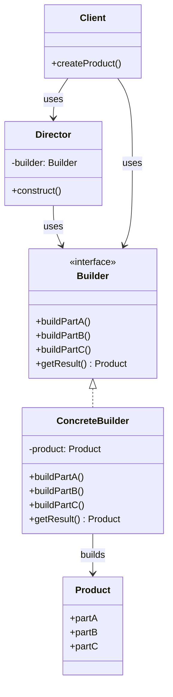

# Builder Pattern

## Description

The Builder Pattern is a creational design pattern that constructs complex objects step by step. It allows you to produce different types and representations of an object using the same construction code. The pattern separates the construction of a complex object from its representation, enabling the same construction process to create different representations.

The Builder Pattern is particularly useful when an object has many optional parameters or when the construction process is complex. Instead of using a constructor with many parameters (which can be error-prone and hard to read), the Builder Pattern uses a separate builder object that receives each construction parameter step by step and then returns the resulting constructed object.

The pattern consists of four main components:
- **Product**: The complex object that is being built
- **Builder Interface**: Defines the steps for building the product
- **Concrete Builder**: Implements the builder interface and provides specific implementations for constructing parts of the product
- **Director**: Optional class that defines the order in which to execute the building steps

The Builder Pattern promotes code readability and maintainability by providing a fluent interface for object construction. It also allows you to create immutable objects by building the object completely before returning it, and it makes it easy to add new construction steps without modifying existing code.

The pattern is particularly useful when constructing objects with many optional parameters, when you want to create different representations of the same object, or when you need to ensure that the object is fully constructed before use.

## When to Use

The Builder Pattern should be used in the following scenarios:

### 1. Complex Object Construction
When constructing objects with many optional parameters or complex initialization logic. The Builder Pattern makes the construction process more readable and manageable than using constructors with many parameters.

### 2. Immutable Objects
When you want to create immutable objects. The builder can construct the object completely before returning it, ensuring the object is in a valid state and cannot be modified after construction.

### 3. Multiple Representations
When you need to create different representations of the same object. Different concrete builders can construct the same product type with different configurations or from different data sources.

### 4. Step-by-Step Construction
When the construction process involves multiple steps that should be executed in a specific order. The builder can enforce the correct sequence of construction steps.

### 5. Telescoping Constructor Problem
When you want to avoid the telescoping constructor anti-pattern (multiple constructors with increasing numbers of parameters). The Builder Pattern provides a cleaner alternative with better readability.

### 6. Validation During Construction
When you need to validate parameters during construction before creating the object. The builder can perform validation and only create the object if all parameters are valid.

### Common Use Cases
- **Configuration Objects**: Building complex configuration objects with many optional settings
- **SQL Query Builders**: Constructing SQL queries step by step with optional clauses
- **HTTP Request Builders**: Building HTTP requests with headers, body, parameters, etc.
- **Document Builders**: Creating documents (HTML, XML, PDF) with various elements
- **Test Data Builders**: Creating test objects with different combinations of attributes
- **UI Component Builders**: Building complex UI components with many styling and behavior options
- **API Client Builders**: Constructing API clients with various configuration options
- **Database Query Builders**: Building database queries with optional filters, joins, and aggregations

## Class Diagram

The following class diagram illustrates the Builder pattern structure:

## Example Explanation

The class diagram above demonstrates the Builder pattern structure with the following key components:

### Components

1. **Product Class**
   - Represents the complex object being constructed
   - Contains multiple parts (partA, partB, partC) that are built step by step
   - The final product is assembled from these parts

2. **Builder Interface**
   - Defines the common interface for building the product
   - Declares methods for building each part of the product (`buildPartA()`, `buildPartB()`, `buildPartC()`)
   - Provides a method to retrieve the final product (`getResult()`)

3. **Concrete Builder**
   - Implements the `Builder` interface
   - Maintains a reference to the `Product` being built
   - Provides specific implementations for constructing each part of the product
   - Assembles the parts into the final product

4. **Director Class (Optional)**
   - Defines the order in which to execute the building steps
   - Uses a `Builder` to construct the product
   - Encapsulates the construction logic, making it reusable

5. **Client Class**
   - Can use the `Director` to construct products (if using the director variant)
   - Can also use the `Builder` directly to construct products with custom steps
   - Creates the builder and optionally the director, then requests the product

### Relationships

- **Implementation (`<|..`)**: `ConcreteBuilder` implements the `Builder` interface
- **Usage (`-->` with "uses")**: The `Director` uses the `Builder` interface to construct products, and the `Client` uses both `Director` and `Builder`
- **Construction (`-->` with "builds")**: The `ConcreteBuilder` builds the `Product` by assembling its parts

### How It Works

1. The `Client` creates a `ConcreteBuilder` instance
2. Optionally, the client creates a `Director` and passes the builder to it
3. The `Director` (or client directly) calls the builder's methods to build each part of the product (`buildPartA()`, `buildPartB()`, `buildPartC()`)
4. The builder constructs each part and assembles them into the product
5. The client calls `getResult()` on the builder to retrieve the fully constructed product
6. The product is returned in a complete and valid state

This design allows for flexible object construction, where the same construction process can create different representations of the product, and the construction steps can be easily modified or extended without changing the product class.

