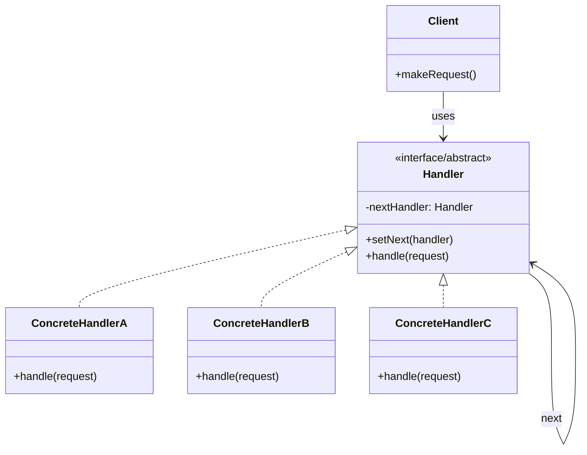

# Chain of Responsibility Pattern

## Description

The Chain of Responsibility Pattern is a behavioral design pattern that passes requests along a chain of handlers. Upon receiving a request, each handler decides either to process the request or to pass it to the next handler in the chain. The pattern allows multiple objects to handle a request without the sender needing to know which object will handle it.

The Chain of Responsibility Pattern decouples the sender of a request from its receivers by giving more than one object a chance to handle the request. The pattern chains the receiving objects and passes the request along the chain until an object handles it or the chain ends.

The pattern consists of three main components:
- **Handler Interface/Abstract Class**: Defines an interface for handling requests and optionally implements the successor link
- **Concrete Handlers**: Implement the handler interface and handle requests they are responsible for. If they can't handle a request, they pass it to the next handler in the chain
- **Client**: Initiates the request to a handler on the chain

The Chain of Responsibility Pattern promotes loose coupling by allowing you to add or remove handlers dynamically, and it gives you flexibility in assigning responsibilities to objects. The pattern also allows you to set up the chain at runtime, making it easy to reconfigure the handling logic.

The pattern is particularly useful when you have multiple objects that can handle a request and you want to determine the handler at runtime, when you want to decouple the sender and receiver of a request, or when you want to add or remove handlers dynamically.

## When to Use

The Chain of Responsibility Pattern should be used in the following scenarios:

### 1. Multiple Potential Handlers
When you have multiple objects that can handle a request, and you want to determine the handler at runtime. The pattern allows the request to be passed along the chain until a handler processes it.

### 2. Dynamic Handler Selection
When you want to specify handlers dynamically or change the chain at runtime. Handlers can be added, removed, or reordered without modifying the client code.

### 3. Decoupling Sender and Receiver
When you want to decouple the object that sends a request from the objects that receive and handle it. The sender doesn't need to know which handler will process the request.

### 4. Request Processing Pipeline
When you need to process requests through multiple stages or filters. Each handler in the chain can perform part of the processing before passing the request to the next handler.

### 5. Event Handling Systems
When implementing event handling systems where events need to be processed by multiple handlers in sequence. Each handler can process the event and decide whether to pass it along.

### 6. Authorization and Validation
When implementing authorization or validation systems where requests need to pass through multiple checks. Each handler can perform a specific check and pass the request to the next handler if it passes.

### Common Use Cases
- **Exception Handling**: Passing exceptions through multiple handlers until one handles it
- **Event Processing**: Processing events through a chain of event handlers
- **Request Filtering**: Filtering HTTP requests through multiple middleware components
- **Logging Systems**: Passing log messages through different log handlers
- **Purchase Approval**: Routing purchase requests through different approval levels
- **Input Validation**: Validating user input through multiple validation rules
- **Error Handling**: Handling errors at different levels of an application
- **Middleware Pipelines**: Processing requests through middleware in web frameworks

## Class Diagram

The following class diagram illustrates the Chain of Responsibility pattern structure:

## Example Explanation

The class diagram above demonstrates the Chain of Responsibility pattern structure with the following key components:

### Components

1. **Handler Interface/Abstract Class**
   - Defines the interface for handling requests
   - Maintains a reference to the next handler in the chain (`nextHandler`)
   - Provides a method to set the next handler (`setNext()`)
   - Declares the `handle()` method that concrete handlers must implement

2. **Concrete Handlers (ConcreteHandlerA, ConcreteHandlerB, ConcreteHandlerC)**
   - Implement the `Handler` interface
   - Handle requests they are responsible for
   - If a handler can't handle a request, it passes the request to the next handler in the chain
   - Each handler can have different criteria for handling requests

3. **Client Class**
   - Initiates requests to handlers on the chain
   - Typically sends the request to the first handler in the chain
   - Doesn't need to know which handler will process the request

### Relationships

- **Implementation (`<|..`)**: `ConcreteHandlerA`, `ConcreteHandlerB`, and `ConcreteHandlerC` implement the `Handler` interface
- **Self-Reference (`-->` with "next")**: The `Handler` class maintains a reference to the next handler in the chain, creating a linked list structure
- **Usage (`-->` with "uses")**: The `Client` uses the `Handler` interface to send requests

### How It Works

1. The `Client` creates a chain of handlers by linking them together using `setNext()`
2. The client sends a request to the first handler in the chain
3. Each handler in the chain:
   - Checks if it can handle the request based on its criteria
   - If it can handle the request, it processes it and may stop the chain
   - If it cannot handle the request, it passes the request to the next handler in the chain
4. The request travels along the chain until a handler processes it or the chain ends
5. If no handler processes the request, it may be ignored or handled by a default handler

This design allows multiple objects to have a chance to handle a request without the sender needing to know which object will handle it, promoting loose coupling and providing flexibility in assigning responsibilities.

