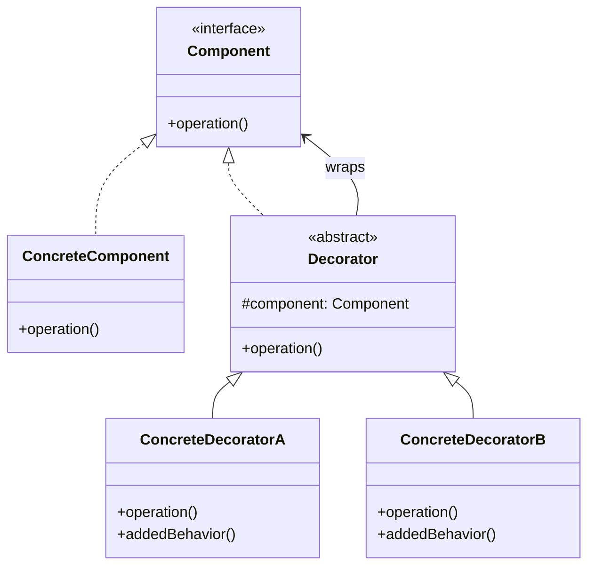

# Decorator Pattern

## Description

The Decorator Pattern is a structural design pattern that allows you to attach new behaviors to objects by placing these objects inside special wrapper objects that contain the behaviors. The pattern lets you dynamically add or remove functionality from an object without altering its structure, providing a flexible alternative to subclassing for extending functionality.

The Decorator Pattern is useful when you need to add responsibilities to individual objects dynamically and transparently, without affecting other objects. Instead of creating a new subclass for every possible combination of features, you can create decorator classes that wrap the original object and add the desired functionality.

The pattern consists of four main components:
- **Component Interface**: Defines the interface for objects that can have responsibilities added to them dynamically
- **Concrete Component**: Defines an object to which additional responsibilities can be attached
- **Decorator Abstract Class**: Maintains a reference to a Component object and defines an interface that conforms to Component's interface
- **Concrete Decorators**: Add specific responsibilities to the component by extending the Decorator class

The Decorator Pattern promotes the Open/Closed Principle by allowing you to extend functionality without modifying existing code. It also provides more flexibility than inheritance, as you can mix and match decorators in any order, and you can add or remove decorators at runtime.

The pattern is particularly useful when you need to add features to objects in a flexible way, when subclassing would result in an explosion of classes, or when you want to add responsibilities to objects dynamically.

## When to Use

The Decorator Pattern should be used in the following scenarios:

### 1. Dynamic Behavior Addition
When you need to add responsibilities to objects dynamically and transparently without affecting other objects. Decorators allow you to add features at runtime rather than compile time.

### 2. Avoiding Subclass Explosion
When extending functionality through inheritance would result in an exponential number of subclasses. For example, if you have a base class and want to add multiple optional features, using inheritance would require creating a subclass for every combination of features.

### 3. Flexible Feature Combination
When you need to combine features in different ways. Decorators can be stacked in any order, allowing for flexible combinations of behaviors without creating a new class for each combination.

### 4. Runtime Feature Selection
When you need to add or remove features at runtime. Unlike inheritance, which is determined at compile time, decorators can be applied and removed dynamically.

### 5. Single Responsibility Principle
When you want to keep classes focused on a single responsibility. Each decorator adds one specific feature, making the code more modular and easier to maintain.

### 6. Open/Closed Principle
When you want to extend functionality without modifying existing code. New decorators can be added without changing the component or other decorators.

### Common Use Cases
- **I/O Streams**: Adding functionality like buffering, compression, or encryption to input/output streams
- **UI Components**: Adding features like scrolling, borders, or shadows to UI components
- **Text Formatting**: Adding formatting options (bold, italic, underline) to text objects
- **Middleware**: Adding cross-cutting concerns like logging, caching, or authentication to services
- **Pizza Toppings**: Adding toppings to a pizza base (a classic example)
- **Coffee Add-ons**: Adding milk, sugar, or flavorings to a coffee base
- **HTTP Request/Response**: Adding headers, compression, or authentication to HTTP requests
- **Graphic Objects**: Adding visual effects like borders, shadows, or animations to graphic objects

## Class Diagram

The following class diagram illustrates the Decorator pattern structure:

## Example Explanation

The class diagram above demonstrates the Decorator pattern structure with the following key components:

### Components

1. **Component Interface**
   - Defines the interface for objects that can have responsibilities added to them dynamically
   - Declares the `operation()` method that both components and decorators must implement
   - Acts as the common interface that allows decorators to wrap components transparently

2. **Concrete Component**
   - Implements the `Component` interface
   - Defines the base object to which additional responsibilities can be attached
   - Provides the basic implementation of `operation()`

3. **Decorator Abstract Class**
   - Implements the `Component` interface and maintains a reference to a `Component` object
   - Defines the base class for all decorators
   - Delegates calls to the wrapped component and can add additional behavior before or after the delegation
   - The protected `component` field holds the reference to the wrapped component

4. **Concrete Decorators (ConcreteDecoratorA and ConcreteDecoratorB)**
   - Extend the `Decorator` abstract class
   - Add specific responsibilities to the component
   - Override the `operation()` method to add behavior before or after calling the wrapped component's operation
   - May add new methods (`addedBehavior()`) that provide additional functionality

### Relationships

- **Implementation (`<|..`)**: `ConcreteComponent` and `Decorator` implement the `Component` interface
- **Inheritance (`<|--`)**: `ConcreteDecoratorA` and `ConcreteDecoratorB` inherit from the `Decorator` abstract class
- **Composition (`-->` with "wraps")**: The `Decorator` class wraps a `Component` object, allowing it to add behavior to the component

### How It Works

1. The client creates a `ConcreteComponent` object
2. The client can wrap the component with one or more decorators (e.g., `ConcreteDecoratorA`, `ConcreteDecoratorB`)
3. Each decorator wraps the component (or another decorator) and adds its own behavior
4. When `operation()` is called on the outermost decorator, it:
   - Performs its own added behavior (before or after)
   - Calls `operation()` on the wrapped component/decorator
   - The call propagates through the chain of decorators to the base component
5. The decorators can be stacked in any order, allowing for flexible combinations of behaviors

This design allows you to add responsibilities to objects dynamically and transparently, with decorators being interchangeable and composable, providing a flexible alternative to subclassing for extending functionality.

