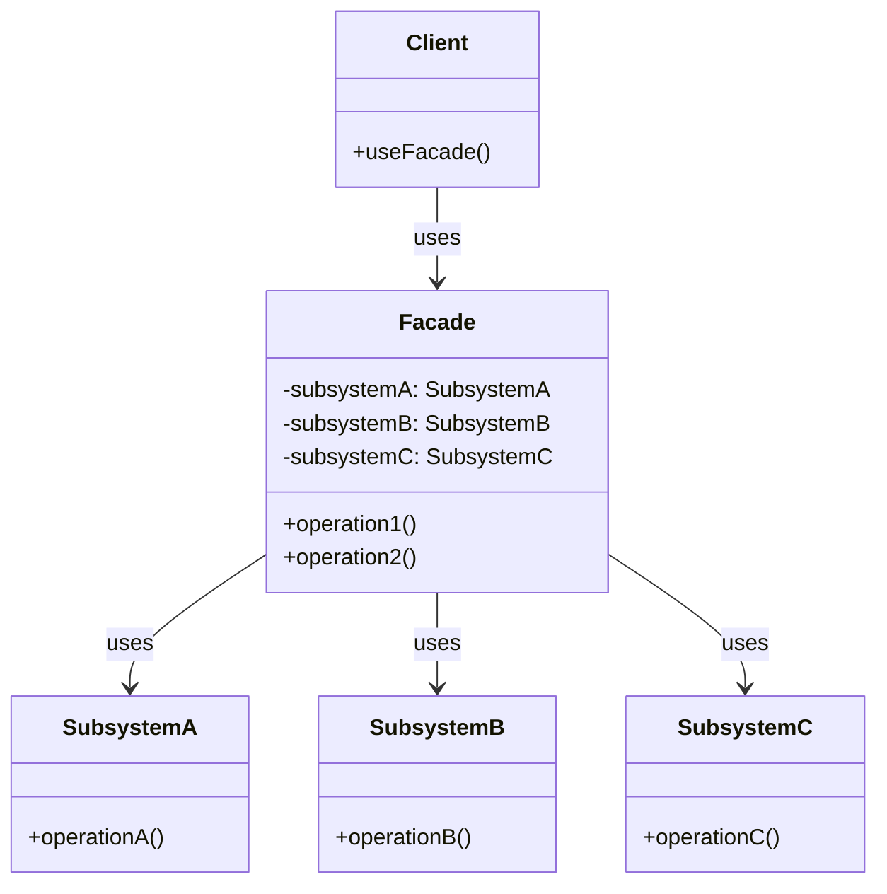

# Facade Pattern

## Description

The Facade Pattern is a structural design pattern that provides a simplified interface to a complex subsystem of classes, libraries, or frameworks. It defines a higher-level interface that makes the subsystem easier to use by hiding its complexity and providing a single entry point for client code.

The Facade Pattern doesn't add new functionality to the subsystem; instead, it provides a unified interface that delegates client requests to appropriate objects within the subsystem. This simplifies the interaction between the client and the subsystem by reducing the number of objects the client needs to deal with and hiding the subsystem's internal structure.

The pattern consists of two main components:
- **Facade**: Provides a simplified interface to the complex subsystem. It knows which subsystem classes are responsible for a request and delegates client calls to appropriate subsystem objects.
- **Subsystem Classes**: Implement subsystem functionality and handle work assigned by the facade. They have no knowledge of the facade and don't keep references to it.

The Facade Pattern promotes loose coupling between the client and the subsystem by introducing an abstraction layer. It also makes the subsystem easier to use, test, and maintain by providing a single point of interaction. Additionally, it can improve code readability and reduce dependencies on subsystem internals.

The pattern is particularly useful when you want to provide a simple interface to a complex subsystem, when you want to decouple clients from subsystem classes, or when you want to layer your subsystems and create entry points for each layer.

## When to Use

The Facade Pattern should be used in the following scenarios:

### 1. Simplifying Complex Subsystems
When you have a complex subsystem with many interdependent classes and want to provide a simple interface for common tasks. The facade hides the complexity and provides a straightforward API.

### 2. Decoupling Clients from Subsystems
When you want to decouple client code from subsystem classes. The facade acts as a mediator, reducing dependencies and making the code more maintainable.

### 3. Layered Architecture
When you want to create entry points for different layers of your application. Each layer can have its own facade that provides a clean interface to the layer below.

### 4. Legacy System Integration
When integrating with legacy systems that have complex interfaces. A facade can provide a modern, simplified interface that wraps the legacy system.

### 5. Reducing Dependencies
When you want to minimize the number of classes that clients need to know about. Instead of clients depending on multiple subsystem classes, they only depend on the facade.

### 6. Providing a Stable API
When you want to provide a stable interface to a subsystem that may change internally. The facade can remain stable while the subsystem evolves, protecting clients from changes.

### Common Use Cases
- **API Wrappers**: Simplifying complex third-party APIs or libraries
- **Database Access Layers**: Providing a simple interface to complex database operations
- **Multimedia Frameworks**: Simplifying interactions with audio/video processing subsystems
- **Operating System Interfaces**: Providing simplified interfaces to complex OS operations
- **Web Frameworks**: Simplifying HTTP request/response handling and routing
- **Payment Gateways**: Providing a unified interface to multiple payment processors
- **Logging Systems**: Simplifying complex logging configurations and operations
- **Configuration Management**: Providing a simple interface to complex configuration systems

## Class Diagram

The following class diagram illustrates the Facade pattern structure:

## Example Explanation

The class diagram above demonstrates the Facade pattern structure with the following key components:

### Components

1. **Facade Class**
   - Provides a simplified interface to the complex subsystem
   - Maintains references to subsystem classes (`SubsystemA`, `SubsystemB`, `SubsystemC`)
   - Implements high-level operations (`operation1()`, `operation2()`) that coordinate calls to subsystem classes
   - Hides the complexity of the subsystem from clients

2. **Subsystem Classes (SubsystemA, SubsystemB, SubsystemC)**
   - Implement specific functionality of the subsystem
   - Have no knowledge of the facade and don't keep references to it
   - Can be used independently or through the facade
   - Handle the actual work assigned by the facade

3. **Client Class**
   - Uses the facade to interact with the subsystem
   - Doesn't need to know about the subsystem classes directly
   - Calls simplified methods on the facade instead of dealing with multiple subsystem classes

### Relationships

- **Usage (`-->` with "uses")**: The `Facade` class uses the subsystem classes (`SubsystemA`, `SubsystemB`, `SubsystemC`) to perform operations, and the `Client` uses the `Facade` to interact with the subsystem

### How It Works

1. The `Client` needs to perform a complex operation that involves multiple subsystem classes
2. Instead of directly interacting with subsystem classes, the client calls a method on the `Facade` (e.g., `operation1()`)
3. The `Facade` coordinates the operation by:
   - Calling appropriate methods on `SubsystemA`, `SubsystemB`, and `SubsystemC`
   - Managing the order of operations and handling any dependencies between subsystem classes
   - Combining the results from multiple subsystem classes if needed
4. The facade returns a simplified result to the client
5. The client remains unaware of the subsystem's internal structure and complexity

This design simplifies the interaction between clients and complex subsystems by providing a single, easy-to-use interface that hides the subsystem's complexity and reduces the number of objects clients need to deal with.

