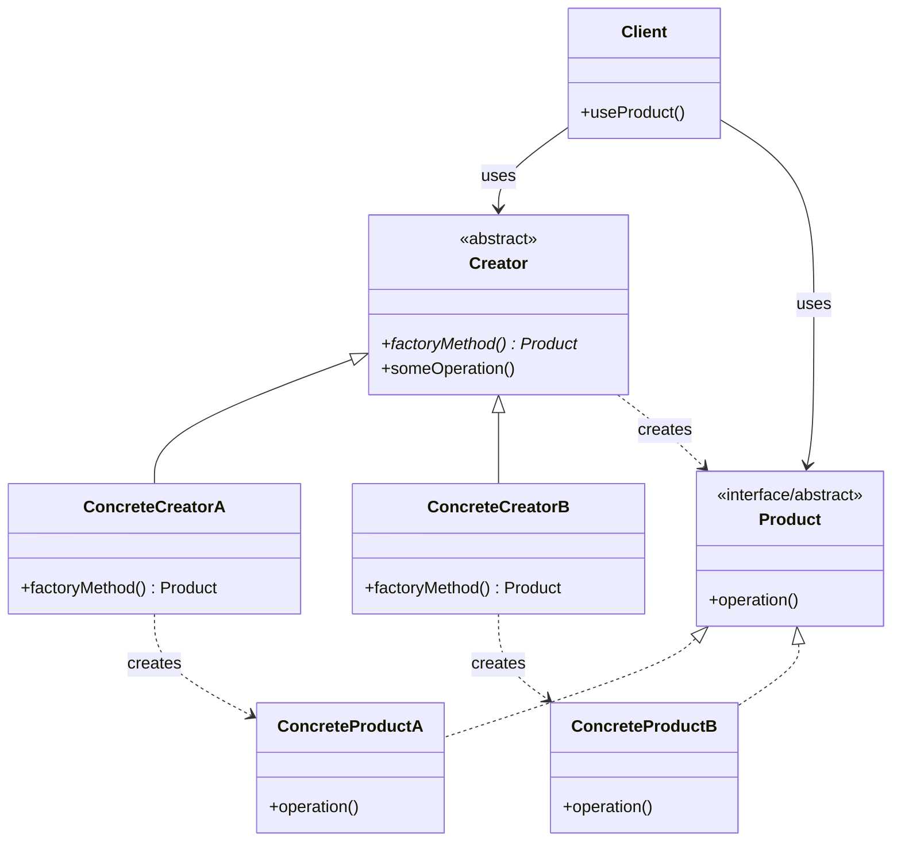

# Factory Pattern

## Description

The Factory Pattern is a creational design pattern that provides an interface for creating objects without specifying their exact classes. Instead of calling a constructor directly, you use a factory method (or factory class) to create objects. This pattern encapsulates object creation logic and allows the system to be independent of how objects are created, composed, and represented.

The Factory Pattern promotes loose coupling by eliminating the need to bind application-specific classes into your code. The code only deals with the product interface, allowing you to introduce new product types without modifying existing code. This makes the code more flexible, maintainable, and extensible.

There are several variations of the Factory Pattern:
- **Simple Factory**: A single factory class with a method that creates different types of objects based on parameters
- **Factory Method**: Defines an interface for creating objects, but lets subclasses decide which class to instantiate
- **Abstract Factory**: Provides an interface for creating families of related or dependent objects without specifying their concrete classes

The pattern is particularly useful when the exact type of object to be created is determined at runtime, or when object creation involves complex logic that should be centralized.

## When to Use

The Factory Pattern should be used in the following scenarios:

### 1. Runtime Object Type Determination
When you need to create objects whose exact type is not known until runtime. For example, creating different types of database connections (MySQL, PostgreSQL, MongoDB) based on configuration or user input.

### 2. Complex Object Creation Logic
When object creation involves complex initialization steps, validation, or configuration that should be encapsulated. This keeps the client code clean and focused on using the object rather than creating it.

### 3. Decoupling Client Code from Concrete Classes
When you want to decouple your code from specific concrete classes. The client code only depends on the product interface, making it easier to add new product types or change existing ones without modifying client code.

### 4. Object Creation Based on Conditions
When object creation depends on various conditions, parameters, or configuration. The factory can centralize this decision-making logic, making it easier to maintain and modify.

### 5. Creating Families of Related Objects
When you need to create families of related or dependent objects that must work together. The Abstract Factory variant is particularly useful here, ensuring that compatible objects are created together.

### 6. Testing and Mocking
When you need to create mock objects for testing. A factory can be easily replaced with a test factory that creates mock objects, making unit testing simpler.

### Common Use Cases
- **UI Component Creation**: Creating different types of buttons, dialogs, or widgets based on the operating system or theme
- **Database Abstraction**: Creating database connection objects for different database systems
- **File Format Handlers**: Creating parsers or processors for different file formats (JSON, XML, CSV)
- **Payment Processing**: Creating payment gateway objects for different payment providers (Stripe, PayPal, Square)
- **Logging Systems**: Creating different types of loggers (file logger, console logger, database logger) based on configuration
- **Notification Systems**: Creating different notification channels (email, SMS, push notification) based on user preferences

## Class Diagram

The following class diagram illustrates the Factory Method pattern structure:

## Example Explanation

The class diagram above demonstrates the Factory Method pattern structure with the following key components:

### Components

1. **Product Interface/Abstract Class**
   - Defines the common interface that all products must implement
   - Contains the `operation()` method that concrete products will implement
   - Acts as the contract that all product types must follow

2. **Concrete Products (ConcreteProductA and ConcreteProductB)**
   - Implement the `Product` interface
   - Provide specific implementations of the `operation()` method
   - Represent the different types of objects that can be created by the factory

3. **Creator Abstract Class**
   - Declares the abstract `factoryMethod()` that returns a `Product`
   - Contains the `someOperation()` template method that uses the factory method
   - Defines the structure for creating products without specifying the exact product type

4. **Concrete Creators (ConcreteCreatorA and ConcreteCreatorB)**
   - Extend the `Creator` abstract class
   - Implement the `factoryMethod()` to return specific concrete products
   - Each concrete creator is responsible for creating a specific type of product

5. **Client Class**
   - Uses the `Creator` and `Product` abstractions
   - Does not depend on concrete product or creator classes
   - Works with the factory to obtain products without knowing their exact types

### Relationships

- **Implementation (`<|..`)**: `ConcreteProductA` and `ConcreteProductB` implement the `Product` interface
- **Inheritance (`<|--`)**: `ConcreteCreatorA` and `ConcreteCreatorB` inherit from the `Creator` abstract class
- **Creation (`..>`)**: 
  - The `Creator` class creates `Product` objects through its factory method
  - `ConcreteCreatorA` creates `ConcreteProductA` instances
  - `ConcreteCreatorB` creates `ConcreteProductB` instances
- **Usage (`-->`)**: The `Client` uses both `Creator` and `Product` to work with the factory pattern

### How It Works

1. The `Client` requests a product by calling `factoryMethod()` on a `Creator` instance
2. The concrete creator (e.g., `ConcreteCreatorA`) implements `factoryMethod()` to return the appropriate concrete product (e.g., `ConcreteProductA`)
3. The client receives a `Product` interface reference and can call `operation()` without knowing the specific product type
4. The `someOperation()` method in `Creator` demonstrates a template method pattern, using the factory method to create and use products

This design allows the client code to remain decoupled from concrete product classes, making it easy to add new product types by creating new concrete products and corresponding concrete creators without modifying existing code.
