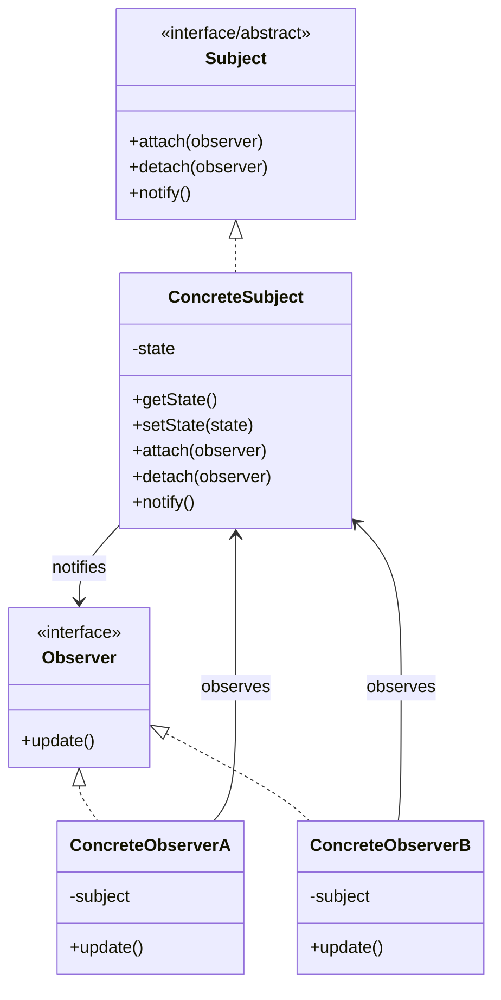

# Observer Pattern

## Description

The Observer Pattern is a behavioral design pattern that defines a one-to-many dependency between objects. When one object (the subject) changes its state, all dependent objects (observers) are automatically notified and updated. This pattern establishes a loose coupling between the subject and its observers, allowing them to interact without being tightly bound to each other.

The Observer Pattern promotes the principle of separation of concerns by decoupling the subject from its observers. The subject doesn't need to know the concrete classes of its observers, only that they implement the Observer interface. This makes the system more flexible and extensible, as new observers can be added or removed without modifying the subject.

The pattern consists of two main components:
- **Subject (Observable)**: The object being observed. It maintains a list of observers and provides methods to attach, detach, and notify observers.
- **Observer**: The interface that defines the update method, which is called when the subject's state changes.

When the subject's state changes, it notifies all registered observers by calling their update methods. This allows multiple observers to react to the same state change independently, enabling a publish-subscribe mechanism where observers subscribe to receive notifications about state changes.

The Observer Pattern is particularly useful in event-driven systems, model-view architectures, and scenarios where you need to maintain consistency between related objects without making them tightly coupled.

## When to Use

The Observer Pattern should be used in the following scenarios:

### 1. Event-Driven Systems
When you need to implement an event-driven architecture where multiple components need to react to events or state changes. This is common in GUI frameworks, where UI components need to update when underlying data changes.

### 2. Model-View Architecture
When implementing the Model-View-Controller (MVC) or Model-View-ViewModel (MVVM) patterns, where views need to automatically update when the model changes. The model acts as the subject, and views act as observers.

### 3. Decoupling Publishers and Subscribers
When you want to decouple the object that produces events (publisher) from the objects that consume events (subscribers). This allows you to add or remove subscribers without modifying the publisher.

### 4. One-to-Many Dependencies
When changes to one object require updating multiple dependent objects, and you want to avoid tight coupling between them. The subject doesn't need to know the specific types of observers.

### 5. Broadcast Communication
When you need to broadcast notifications to multiple recipients without the sender knowing who the recipients are. This is useful in distributed systems and messaging architectures.

### 6. Real-Time Data Updates
When you need to keep multiple displays or components synchronized with the same data source in real-time, such as stock prices, weather updates, or live dashboards.

### Common Use Cases
- **GUI Frameworks**: Updating UI components when underlying data models change
- **Event Handling Systems**: Implementing event listeners and handlers in applications
- **Publish-Subscribe Systems**: Building messaging systems where publishers send messages to subscribers
- **Data Binding**: Keeping views synchronized with data models automatically
- **Notification Systems**: Alerting multiple users or systems about important events
- **Stock Market Applications**: Updating multiple displays with real-time stock prices
- **Social Media Feeds**: Notifying followers when a user posts new content
- **Game Development**: Updating game objects when game state changes

## Class Diagram

The following class diagram illustrates the Observer pattern structure:

## Example Explanation

The class diagram above demonstrates the Observer pattern structure with the following key components:

### Components

1. **Subject Interface/Abstract Class**
   - Defines the interface for managing observers
   - Declares methods to attach, detach, and notify observers
   - Acts as the contract that all subjects must follow

2. **Concrete Subject**
   - Implements the `Subject` interface
   - Maintains the state that observers are interested in
   - Provides methods to get and set the state
   - Implements the notification mechanism to alert all registered observers when state changes

3. **Observer Interface**
   - Defines the `update()` method that is called when the subject's state changes
   - Acts as the contract that all observers must implement
   - Allows the subject to notify observers without knowing their concrete types

4. **Concrete Observers (ConcreteObserverA and ConcreteObserverB)**
   - Implement the `Observer` interface
   - Maintain a reference to the subject they are observing
   - Implement the `update()` method to react to state changes
   - Each observer can have its own specific behavior when notified

### Relationships

- **Implementation (`<|..`)**: `ConcreteSubject` implements the `Subject` interface, and `ConcreteObserverA` and `ConcreteObserverB` implement the `Observer` interface
- **Notification (`-->` with "notifies")**: The `ConcreteSubject` notifies all registered `Observer` objects when its state changes
- **Observation (`-->` with "observes")**: `ConcreteObserverA` and `ConcreteObserverB` observe the `ConcreteSubject` to receive notifications about state changes

### How It Works

1. Observers register themselves with the subject by calling `attach()` method
2. When the subject's state changes (via `setState()`), it calls `notify()` method
3. The `notify()` method iterates through all registered observers and calls their `update()` method
4. Each observer's `update()` method is executed, allowing them to react to the state change independently
5. Observers can unregister themselves by calling `detach()` method when they no longer need to receive notifications

This design allows multiple observers to be notified of state changes without the subject needing to know the specific types of observers, promoting loose coupling and flexibility in the system.
