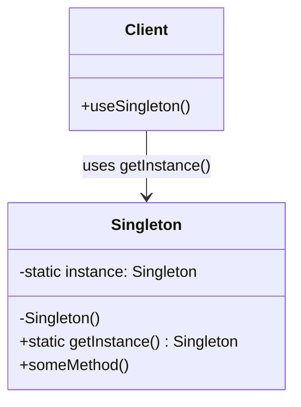

# Singleton Pattern

## Description

The Singleton Pattern is a creational design pattern that ensures a class has only one instance and provides a global point of access to that instance. This pattern restricts the instantiation of a class to a single object, which is useful when exactly one object is needed to coordinate actions across the system.

The Singleton Pattern solves two problems simultaneously:
- **Controlled Access**: It ensures that only one instance of a class exists in the application
- **Global Access Point**: It provides a well-known access point to that instance

The pattern is implemented by making the constructor private, preventing other classes from instantiating the class directly, and providing a static method that returns the single instance. The instance is typically created lazily (on first access) or eagerly (at class loading time).

There are several implementation variations of the Singleton Pattern:
- **Eager Initialization**: The instance is created when the class is loaded
- **Lazy Initialization**: The instance is created only when first requested
- **Thread-Safe Singleton**: Ensures the pattern works correctly in multi-threaded environments
- **Double-Checked Locking**: An optimization for thread-safe lazy initialization

The Singleton Pattern is particularly useful for managing shared resources such as database connections, configuration managers, logging systems, and caching mechanisms where having multiple instances could cause problems or waste resources.

## When to Use

The Singleton Pattern should be used in the following scenarios:

### 1. Single Instance Requirement
When you need exactly one instance of a class to exist throughout the application's lifetime. This is essential for resources that should be shared globally, such as a database connection pool or a configuration manager.

### 2. Global Access Point
When you need a well-known access point to a single instance from anywhere in your application. The singleton provides a controlled way to access the instance without passing it through multiple layers of your application.

### 3. Resource Management
When managing expensive resources that should be reused, such as database connections, file handles, or network connections. Creating multiple instances would be wasteful and could lead to resource exhaustion.

### 4. Shared State Management
When you need to maintain shared state across the entire application. A singleton can serve as a central repository for application-wide state that needs to be accessed and modified from multiple places.

### 5. Logging and Configuration
When implementing logging systems or configuration managers where you want a single point of control. All parts of the application should log to the same logger or read from the same configuration source.

### 6. Caching Mechanisms
When implementing caching systems where you want a single cache instance to be shared across the entire application, ensuring consistency and avoiding duplicate cache entries.

### Common Use Cases
- **Database Connection Pools**: Managing a single pool of database connections
- **Configuration Managers**: Centralized application configuration
- **Logging Systems**: Single logger instance for the entire application
- **Cache Managers**: Shared caching mechanism across the application
- **Thread Pools**: Managing a single pool of worker threads
- **Device Drivers**: Representing hardware devices that can only have one instance
- **Registry Settings**: Managing system or application registry settings
- **Service Locators**: Providing a global point of access to services

## Class Diagram

The following class diagram illustrates the Singleton pattern structure:

## Example Explanation

The class diagram above demonstrates the Singleton pattern structure with the following key components:

### Components

1. **Singleton Class**
   - Contains a private static field `instance` that holds the single instance of the class
   - Has a private constructor `Singleton()` that prevents other classes from instantiating the class directly
   - Provides a public static method `getInstance()` that returns the single instance, creating it if it doesn't exist (lazy initialization)
   - May contain other instance methods (`someMethod()`) that define the behavior of the singleton

2. **Client Class**
   - Uses the Singleton by calling the static `getInstance()` method
   - Cannot directly instantiate the Singleton due to the private constructor
   - Accesses the singleton instance through the `getInstance()` method

### Relationships

- **Usage (`-->` with "uses getInstance()")**: The `Client` class uses the `Singleton` class by calling its static `getInstance()` method to obtain the single instance

### How It Works

1. The `Client` requests the singleton instance by calling `Singleton.getInstance()`
2. The `getInstance()` method checks if the `instance` field is null
3. If the instance doesn't exist, it creates a new instance and stores it in the static field
4. The method returns the existing or newly created instance
5. Subsequent calls to `getInstance()` return the same instance that was created the first time
6. The private constructor ensures that no other code can create additional instances of the class

This design ensures that only one instance of the Singleton class exists throughout the application's lifetime, providing controlled access to a shared resource and maintaining consistency across the system.

