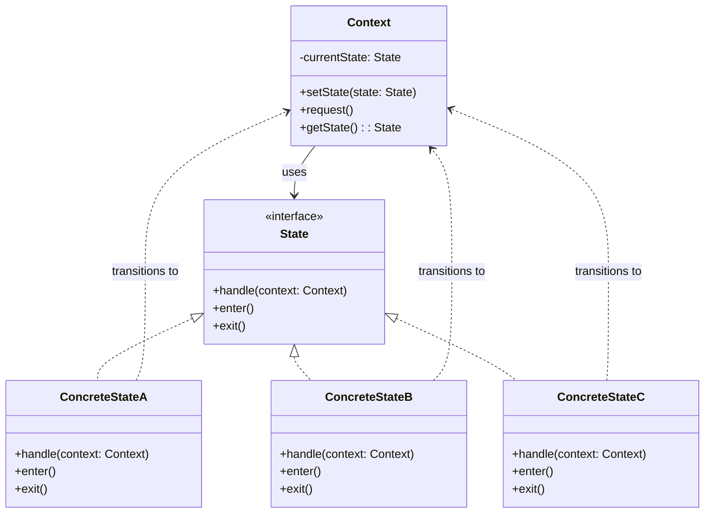

# State Machine Pattern

## Description

The State Machine Pattern (also known as the State Pattern) is a behavioral design pattern that allows an object to alter its behavior when its internal state changes. The object will appear to change its class. This pattern is particularly useful when an object's behavior depends on its state, and it must change its behavior at runtime depending on that state.

The State Machine Pattern promotes the Single Responsibility Principle by separating state-specific behavior into separate classes. Each state is represented by a separate class, and the context object delegates state-specific behavior to the current state object. This makes the code more maintainable, as adding new states or modifying existing state behavior doesn't require changing other states or the context.

The pattern consists of three main components:
- **Context**: The class that maintains a reference to the current state object and delegates state-specific behavior to it. The context doesn't know the concrete state classes, only the state interface.
- **State Interface**: Defines a common interface for all concrete states. This interface declares methods that represent state-specific behavior.
- **Concrete States**: Implement the state interface, each providing specific behavior for a particular state. Each concrete state knows which other states it can transition to.

When the context needs to perform an action, it delegates the request to the current state object. The state object handles the request and may trigger a state transition by changing the context's current state to a different state object.

The State Machine Pattern is particularly useful for objects that have complex state-dependent behavior, such as vending machines, game characters, workflow systems, or any system where behavior changes based on internal state.

## When to Use

The State Machine Pattern should be used in the following scenarios:

### 1. State-Dependent Behavior
When an object's behavior depends on its state, and it must change its behavior at runtime based on that state. The object behaves differently in different states, and these state transitions are well-defined.

### 2. Multiple Conditional Statements Based on State
When you have many conditional statements (if-else or switch-case) that check the object's state to determine behavior. The State pattern can eliminate these conditionals by moving state-specific behavior into separate state classes.

### 3. Complex State Transitions
When you have complex state transition logic where states can transition to multiple other states based on different conditions. The State pattern makes these transitions explicit and easier to manage.

### 4. State-Specific Behavior
When different states require different sets of operations or when some operations are only valid in certain states. Each state class can define which operations are valid and how they should behave.

### 5. Avoiding State-Related Bugs
When you want to prevent invalid state transitions or operations. Each state can enforce which transitions are allowed and which operations are valid in that state, reducing bugs.

### 6. Clear State Management
When you need to clearly model and manage the lifecycle of an object through different states, making the state machine explicit and easy to understand.

### Common Use Cases
- **Vending Machines**: Different states (idle, hasMoney, dispensing, outOfStock) with different behaviors
- **Game Development**: Game objects with different states (idle, walking, running, jumping, attacking)
- **Workflow Systems**: Document or task states (draft, review, approved, rejected, published)
- **Order Processing**: Order states (pending, processing, shipped, delivered, cancelled)
- **Media Players**: Player states (stopped, playing, paused, buffering)
- **Traffic Lights**: Light states (red, yellow, green) with automatic transitions
- **ATM Machines**: ATM states (idle, cardInserted, pinEntered, transactionInProgress, outOfService)
- **Elevator Systems**: Elevator states (idle, moving, doorOpen, doorClosing, emergency)
- **Payment Processing**: Payment states (initiated, processing, completed, failed, refunded)
- **User Authentication**: Session states (loggedOut, loggedIn, expired, locked)

## Class Diagram

The following class diagram illustrates the State Machine pattern structure:

## Example Explanation

The class diagram above demonstrates the State Machine pattern structure with the following key components:

### Components

1. **Context Class**
   - Maintains a reference to the current `State` object
   - Provides a method to change the current state (`setState()`)
   - Delegates state-specific behavior to the current state object through the `request()` method
   - May store context-specific data that states need to access
   - Doesn't need to know the specific implementation of each state

2. **State Interface**
   - Defines a common interface for all concrete states
   - Declares methods that represent state-specific behavior (e.g., `handle()`)
   - May include lifecycle methods like `enter()` and `exit()` for state entry/exit actions
   - Acts as the contract that allows states to be interchangeable

3. **Concrete States (ConcreteStateA, ConcreteStateB, ConcreteStateC)**
   - Implement the `State` interface
   - Provide specific implementations of state-specific behavior
   - Each state knows which other states it can transition to
   - Can trigger state transitions by calling `context.setState()` with a new state
   - May have access to context data to make transition decisions

### Relationships

- **Usage (`-->`)**: The `Context` class uses the `State` interface to delegate behavior to the current state
- **Implementation (`<|..`)**: `ConcreteStateA`, `ConcreteStateB`, and `ConcreteStateC` implement the `State` interface
- **State Transition (`..>`)**: Concrete states can transition the context to other states by calling `context.setState()`

### How It Works

1. The `Context` class is initialized with an initial state (e.g., `ConcreteStateA`)
2. When the context receives a request (via `request()`), it delegates the request to the current state object
3. The current state's `handle()` method is called, which performs state-specific behavior
4. The state may trigger a transition by calling `context.setState()` with a new state object
5. When a state transition occurs:
   - The current state's `exit()` method is called (if implemented)
   - The context's state is updated to the new state
   - The new state's `enter()` method is called (if implemented)
6. Subsequent requests are handled by the new state

### Key Benefits

- **Eliminates Conditional Logic**: Replaces complex if-else or switch statements with polymorphism
- **Single Responsibility**: Each state class handles behavior for one state
- **Open/Closed Principle**: Easy to add new states without modifying existing states or context
- **Explicit State Transitions**: Makes state transitions clear and explicit
- **State-Specific Behavior**: Each state can have its own set of valid operations
- **Easier Testing**: Each state can be tested independently

### Example: Vending Machine

A vending machine is a classic example of the State pattern:

**States:**
- `IdleState`: Waiting for money
- `HasMoneyState`: Money inserted, waiting for selection
- `DispensingState`: Product being dispensed
- `OutOfStockState`: Product unavailable

**State Transitions:**
- `IdleState` → `HasMoneyState` (when money inserted)
- `HasMoneyState` → `DispensingState` (when product selected)
- `DispensingState` → `IdleState` (after dispensing)
- `HasMoneyState` → `IdleState` (if refund requested)
- Any state → `OutOfStockState` (if product runs out)

Each state handles operations differently:
- `insertMoney()`: Only valid in `IdleState`
- `selectProduct()`: Only valid in `HasMoneyState`
- `dispenseProduct()`: Only valid in `DispensingState`
- `refund()`: Valid in `HasMoneyState`

This design makes the state machine explicit, prevents invalid operations, and makes it easy to add new states or modify state behavior.

