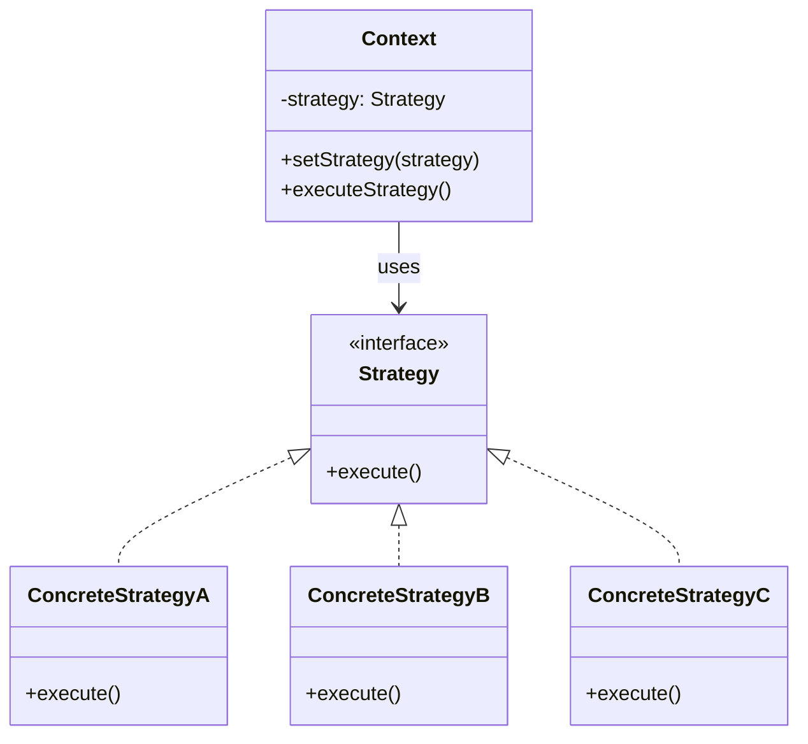

# Strategy Pattern

## Description

The Strategy Pattern is a behavioral design pattern that defines a family of algorithms, encapsulates each one, and makes them interchangeable. The pattern lets the algorithm vary independently from the clients that use it. Instead of implementing a single algorithm directly, code receives run-time instructions about which algorithm to use.

The Strategy Pattern promotes the Open/Closed Principle by allowing you to add new strategies without modifying existing code. It encapsulates each algorithm in a separate class, making them interchangeable and allowing the client to choose the appropriate strategy at runtime.

The pattern consists of three main components:
- **Context**: The class that uses a strategy. It maintains a reference to a strategy object and delegates the work to it.
- **Strategy Interface**: Defines a common interface for all concrete strategies. This interface is used by the context to call the algorithm defined by a concrete strategy.
- **Concrete Strategies**: Implement the strategy interface, each providing a different implementation of the algorithm.

The context doesn't need to know the specific implementation of the algorithm. It works with strategies through the strategy interface, allowing you to switch between different algorithms at runtime without changing the context code.

The Strategy Pattern is particularly useful when you have multiple ways to perform a task, and you want to choose the algorithm at runtime, or when you want to avoid conditional statements for selecting algorithms.

## When to Use

The Strategy Pattern should be used in the following scenarios:

### 1. Multiple Algorithm Implementations
When you have multiple ways to perform a task and want to choose the algorithm at runtime. For example, different sorting algorithms (quick sort, merge sort, bubble sort) or different payment methods (credit card, PayPal, cryptocurrency).

### 2. Avoiding Conditional Statements
When you want to eliminate large conditional statements (if-else or switch-case) that select different algorithms. The Strategy Pattern replaces these conditionals with polymorphism.

### 3. Runtime Algorithm Selection
When the algorithm to use should be determined at runtime based on user input, configuration, or other dynamic factors. This provides flexibility in choosing the appropriate strategy.

### 4. Algorithm Encapsulation
When you want to encapsulate algorithms in separate classes, making them easier to understand, test, and maintain. Each strategy class focuses on a single algorithm implementation.

### 5. Open/Closed Principle
When you want to add new algorithms without modifying existing code. You can add new strategy classes without changing the context or other strategies.

### 6. Algorithm Reusability
When you want to reuse algorithms across different contexts. Strategies can be shared and reused in different parts of the application.

### Common Use Cases
- **Payment Processing**: Different payment methods (credit card, PayPal, bank transfer, cryptocurrency)
- **Sorting Algorithms**: Different sorting strategies (quick sort, merge sort, heap sort)
- **Compression**: Different compression algorithms (ZIP, RAR, 7Z)
- **Data Validation**: Different validation strategies based on data type or rules
- **Discount Calculation**: Different discount strategies (percentage, fixed amount, buy-one-get-one)
- **Navigation**: Different routing algorithms (shortest path, fastest route, scenic route)
- **File Format Conversion**: Different conversion strategies (PDF to Word, Image to PDF)
- **Authentication**: Different authentication methods (OAuth, JWT, session-based)

## Class Diagram

The following class diagram illustrates the Strategy pattern structure:

## Example Explanation

The class diagram above demonstrates the Strategy pattern structure with the following key components:

### Components

1. **Context Class**
   - Maintains a reference to a `Strategy` object
   - Provides a method to set or change the strategy at runtime (`setStrategy()`)
   - Delegates the work to the strategy object through the `executeStrategy()` method
   - Doesn't need to know the specific implementation of the algorithm

2. **Strategy Interface**
   - Defines a common interface for all concrete strategies
   - Declares the `execute()` method that all strategies must implement
   - Acts as the contract that allows strategies to be interchangeable

3. **Concrete Strategies (ConcreteStrategyA, ConcreteStrategyB, ConcreteStrategyC)**
   - Implement the `Strategy` interface
   - Provide specific implementations of the `execute()` method
   - Each strategy encapsulates a different algorithm or approach
   - Can be added, removed, or modified independently without affecting the context

### Relationships

- **Usage (`-->`)**: The `Context` class uses the `Strategy` interface to execute algorithms
- **Implementation (`<|..`)**: `ConcreteStrategyA`, `ConcreteStrategyB`, and `ConcreteStrategyC` implement the `Strategy` interface

### How It Works

1. The `Context` class maintains a reference to a `Strategy` object
2. The client sets the desired strategy using `setStrategy()` method
3. When `executeStrategy()` is called, the context delegates the work to the current strategy
4. The strategy's `execute()` method is called, performing the specific algorithm
5. The strategy can be changed at runtime by calling `setStrategy()` with a different concrete strategy

This design allows the context to work with different algorithms interchangeably, making it easy to add new strategies or modify existing ones without changing the context code. The pattern promotes flexibility, maintainability, and follows the Open/Closed Principle.

